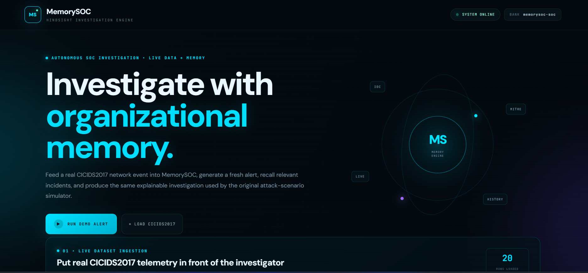
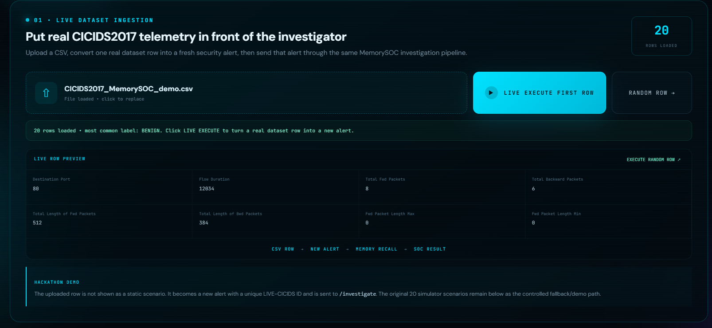
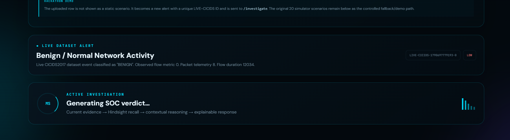
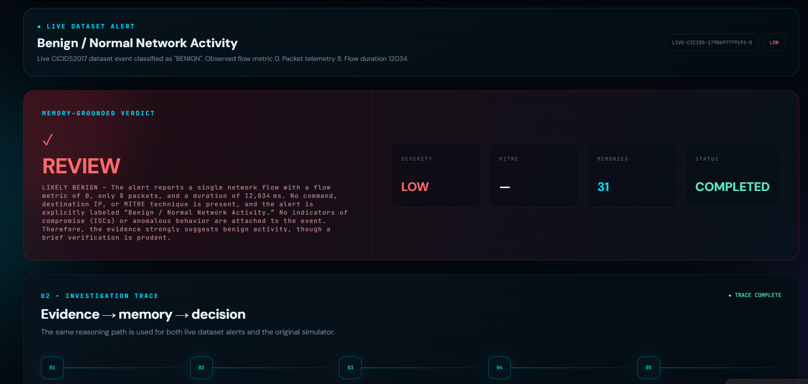
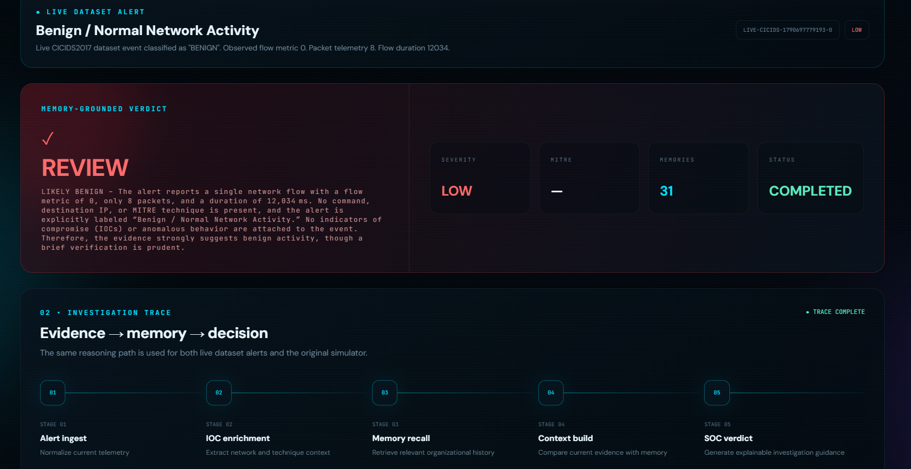
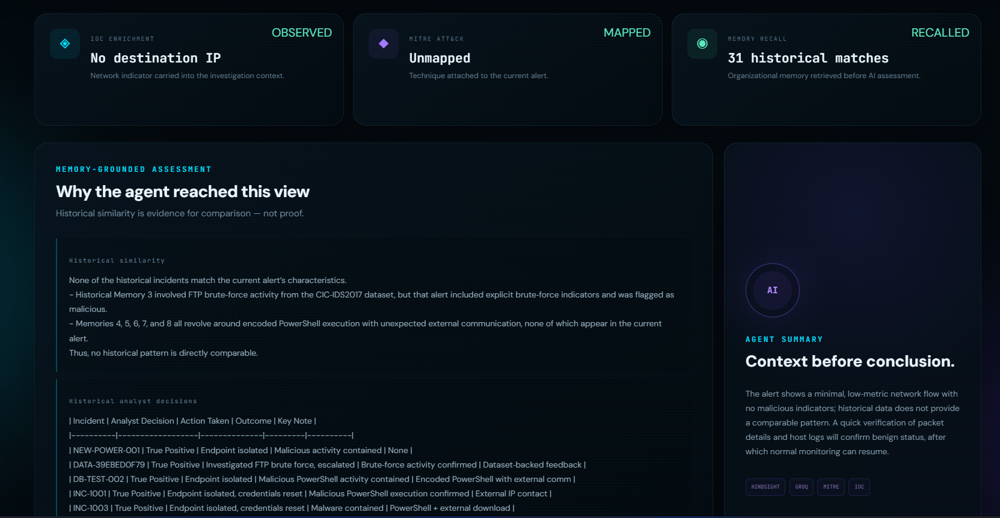
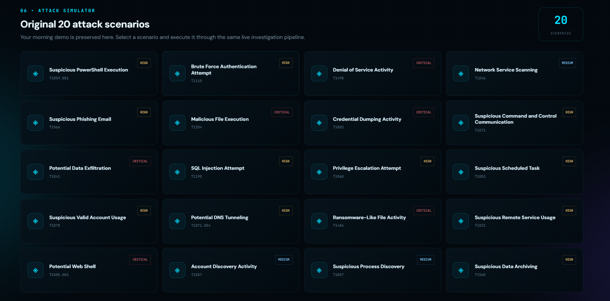

# MemorySOC — Hindsight Proof of Concept

Persistent-memory AI SOC investigation agent.

## What this POC proves

1. Start a Hindsight server.
2. Create/seed an organizational memory bank with SOC incidents.
3. Recall relevant historical incidents for a new security alert.
4. Optionally use Hindsight `reflect` to generate a context-aware response.
5. Retain the new investigation outcome so future alerts can use it.

This is intentionally the first vertical slice of MemorySOC. The full UI, PostgreSQL application database, IOC tools, MITRE mapping, and production deployment come later.

## Current architecture

```text
New SOC Alert
     |
     v
FastAPI POC
     |
     +----> Hindsight recall
     |          |
     |          v
     |   Historical incidents
     |
     +----> Hindsight reflect (optional)
     |
     +----> Hindsight retain
                  |
                  v
        Persistent organizational memory
```

## Prerequisites

- Docker Desktop
- Python 3.11+
- An LLM API key supported by Hindsight
- Internet access for pulling the Hindsight image and Python packages

The current Hindsight quickstart documents Docker on ports 8888 (API) and 9999 (control-plane UI), and the Python client package `hindsight-client`.

## 1. Start Hindsight

### Option A: Docker

Set your LLM key in your shell and run:

```bash
docker run -it --pull always --name hindsight --restart unless-stopped --shm-size=1g \
  -p 8888:8888 -p 9999:9999 \
  -e HINDSIGHT_API_LLM_API_KEY="$OPENAI_API_KEY" \
  -e HINDSIGHT_API_WORKER_ID="memorysoc-dev" \
  -v hindsight-data:/home/hindsight/.pg0 \
  ghcr.io/vectorize-io/hindsight:latest
```

If you use a different provider/model, set the Hindsight environment variables according to the provider configuration in the current Hindsight documentation.

Hindsight API: http://localhost:8888  
Hindsight UI: http://localhost:9999

### Option B: docker compose

Create `.env` from `.env.example`, put your key in it, then:

```bash
docker compose up -d
```

## 2. Start MemorySOC POC

```bash
cd backend
python -m venv .venv
```

Windows:

```powershell
.venv\Scripts\activate
```

macOS/Linux:

```bash
source .venv/bin/activate
```

Install dependencies:

```bash
pip install -r requirements.txt
```

Copy environment file:

```bash
cp ../.env.example ../.env
```

Start the API:

```bash
uvicorn main:app --reload --port 8000
```

API: http://localhost:8000  
Swagger: http://localhost:8000/docs

## 3. Seed the SOC memories

In another terminal:

```bash
curl -X POST http://localhost:8000/seed
```

This stores three deliberately related synthetic SOC incidents in the `memorysoc-soc` Hindsight bank.

## 4. Test the memory

```bash
curl -X POST http://localhost:8000/investigate \
  -H "Content-Type: application/json" \
  -d @../data/new_alert.json
```

The response contains:
- the alert
- Hindsight recall results
- an optional Hindsight reflect answer

## 5. Retain analyst feedback

```bash
curl -X POST http://localhost:8000/feedback \
  -H "Content-Type: application/json" \
  -d '{
    "alert_id": "NEW-POWER-001",
    "decision": "true_positive",
    "action": "Endpoint isolated",
    "outcome": "Malicious PowerShell execution contained"
  }'
```

Then run another investigation. The newly retained outcome can become part of future recall.

## Important implementation note

The Hindsight server is the memory system. PostgreSQL for the eventual MemorySOC application will store application state such as alert records and analyst feedback; it should not replace Hindsight's persistent memory layer.

## Next build step

After this POC works end-to-end, add:
1. LLM agent orchestration around the recalled memories.
2. PostgreSQL application state.
3. IOC and MITRE tools.
4. Next.js SOC dashboard.
5. Memory ON/OFF demo comparison.
6. Final 3-minute demo flow.


## 📸 Project Screenshots

### 1. MemorySOC Dashboard
Main MemorySOC interface showing the organizational-memory investigation workflow.



### 2. Live CICIDS2017 Dataset Ingestion
Upload real CICIDS2017 telemetry and convert a dataset row into a fresh security alert.



### 3. Active Investigation
MemorySOC processes the incoming alert through the investigation pipeline.



### 4. Memory-Grounded Verdict
The system generates an explainable SOC verdict using current evidence and recalled organizational memory.



### 5. Investigation Trace
Shows the investigation flow:

**Alert Ingest → IOC Enrichment → Memory Recall → Context Build → SOC Verdict**



### 6. Memory Assessment
Shows historical incident matching and how previous analyst decisions contribute to the investigation.



### 7. Attack Scenarios
Original attack-simulation scenarios available in MemorySOC.


